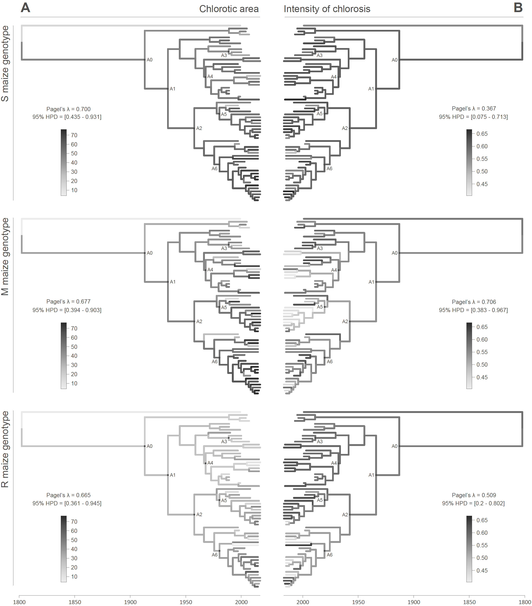

This repo gathers the input files and scripts related to our study entitled "**Symptom evolution following the emergence of maize streak virus**" ([Monjane\*, Dellicour\* *et al*. 2020](https://elifesciences.org/articles/51984), *eLife*). R scripts related to the analyses are all gathered within the file `All_R_scripts.r`.

Abstract: For pathogens infecting single host species evolutionary trade-offs have previously been demonstrated between pathogen-induced mortality rates and transmission rates. It remains unclear, however, how such trade-offs impact sub-lethal pathogen-inflicted damage, and whether these trade-offs even occur in broad host-range pathogens. Here, we examine changes over the past 110 years in symptoms induced in maize by the broad host-range pathogen, maize streak virus (MSV). Specifically, we use the quantified symptom intensities of cloned MSV isolates in differentially resistant maize genotypes to phylogenetically infer ancestral symptom intensities and check for phylogenetic signal associated with these symptom intensities. We show that whereas symptoms reflecting harm to the host have remained constant or decreased, there has been an increase in how extensively MSV colonizes the cells upon which transmission vectors feed. This demonstrates an evolutionary trade-off between amounts of pathogen-inflicted harm and how effectively viruses position themselves within plants to enable onward transmission.

**Figure: continuous character mapping of symptom intensities, chlorotic area (A) and intensity of chlorosis (B), onto the MSV-A maximum clade credibility tree.** 
Symptom intensities of ancestral viruses were phylogenetically inferred based on those observed in sensitive (S), moderately resistant (M) and resistant (R) maize genotypes infected by 59 MSV-A isolates and one MSV-B isolate (the outgroup), sampled between 1979 and 2007. The intensities of symptoms are represented by coloured branches on a grey-scale. ‘A0-A6’ indicate the ancestral nodes of the constrained clades for which MRCA sequences were inferred, synthesised and used to verify symptom intensity estimates. For each maximum clade credibility tree, we also report Pagel’s λ values (Pagel, 1999), which indicate the degree of phylogenetic signal associated with the various symptom measurements.